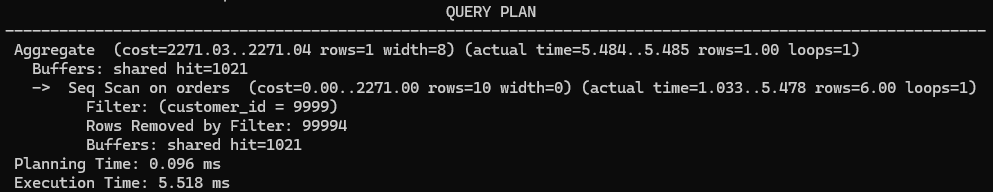
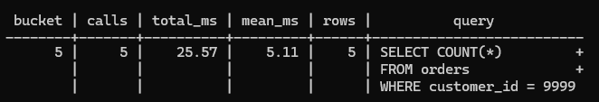

# Contents {#contents .TOC-Heading}

[Overview [1](#overview)](#overview)

[Setting up Docker [1](#_Toc241599250)](#_Toc241599250)

[Creating the Database [1](#_Toc241599251)](#_Toc241599251)

[Testing [2](#testing)](#testing)

[Before Optimization [2](#before-optimization)](#before-optimization)

[Optimization [2](#optimization)](#optimization)

[After Optimization [2](#_Toc241599255)](#_Toc241599255)

[Test Conclusion [3](#_Toc241599256)](#_Toc241599256)

# Overview

[]{#_Toc241599250 .anchor}This is a simple demonstration of one way in which PostgreSQL's \"EXPLAIN ANALYZE\" feature and the pg_stat_monitor tool provided by Percona can be used to investigate query performance.

> **Note**  
> \"EXPLAIN ANALYZE\" can be used to show execution statistics for a single execution of a query.
> pg_stat_monitor can be used to show aggregated statistics for multiple executions of a query.

# Setting up Docker

[]{#_Toc241599251 .anchor}A Percona Distribution for PostgreSQL image is available for Docker. I created a docker-compose.yml file to pull the image and configure it to preload the library needed by pg_stat_monitor.

# Creating the Database

I used an SQL script to create a database with two tables:

- customers (10,000 entries)

- orders (100,000 entries)

> **Note** 
> In practice, I used the following command to both start the Docker image and run the script)
> 
>   --------------------------------------------------------------------------------------------------
>   docker exec -i percona-postgres-demo \\ psql -U postgres -d kayak_shop \< sql/01-create-data.sql
>   --------------------------------------------------------------------------------------------------
>  
>   --------------------------------------------------------------------------------------------------

# Testing 

## Before Optimization

I ran a simple test query to count how many orders belong to a particular customer ID. I repeated the same query five times so that pg_stat_monitor would have multiple executions from which to calculate an average.

I then ran \"EXPLAIN ANALYZE\" to examine the execution plan and actual execution time for the query. The result showed that a single execution took 5.518 ms.

I then queried pg_stat_monitor for statistics about the test query. The result showed a mean execution time of 5.11 ms across the five calls.

{width="6.27in" height="1.21in"}

{width="6.27in" height="1.07in"}

## Optimization

[]{#_Toc241599255 .anchor}I created an index on the customer_id column of the orders table.

## After Optimization

[]{#_Toc241599256 .anchor}I ran the test query again five times and then ran \"EXPLAIN ANALYZE\" and the pg_stat_monitor query again.

The \"EXPLAIN ANALYZE\" result showed that a single execution of the test query took 0.092 ms.

The pg_stat_monitor result showed a mean execution time of 0.04 ms across the five calls.

# Test Conclusion

In this test, \"EXPLAIN ANALYZE\" showed a decrease in execution time from 5.518 ms to 0.092 ms after the index was added: a reduction of 5.426 ms (approximately 98%).

pg_stat_monitor showed a decrease in mean execution time from 5.11 ms to 0.04 ms across the five test calls: a reduction of 5.07 ms (approximately 99%).

Note: These results are specific to this test dataset and environment.

> **Note**  
> These results are specific to this test dataset and environment. 